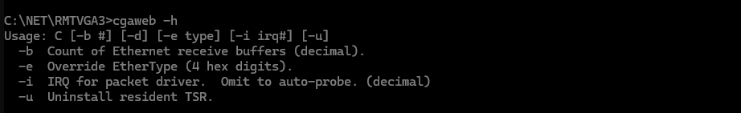
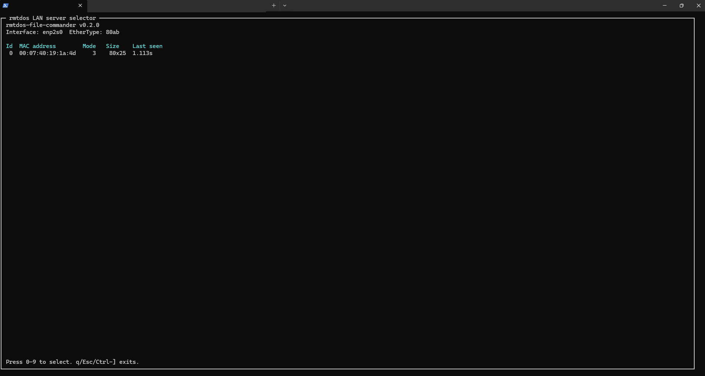
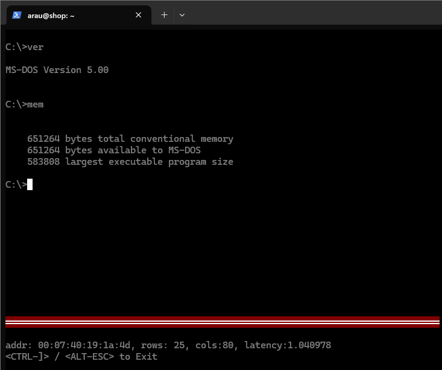
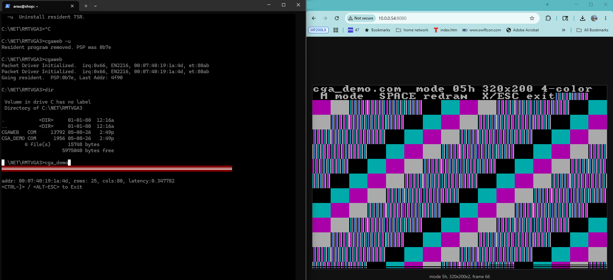
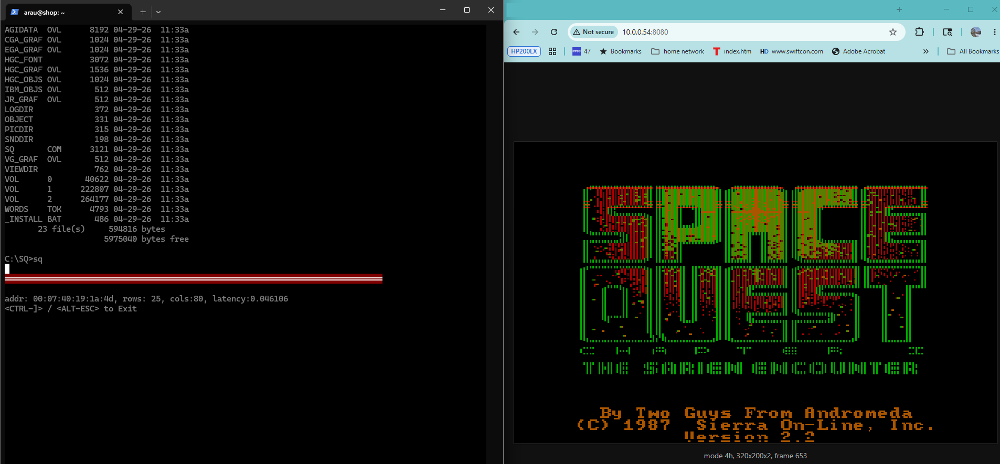
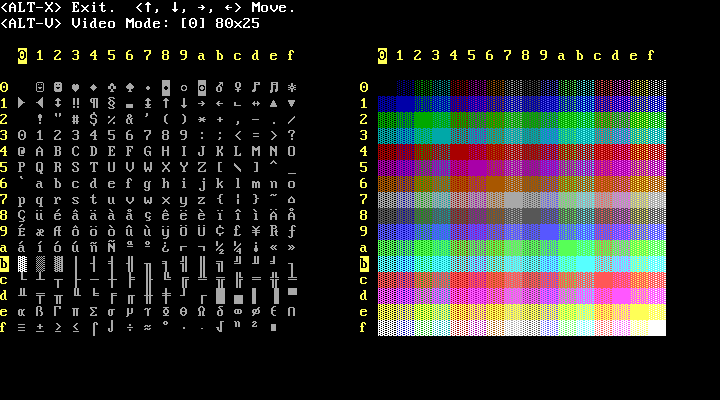
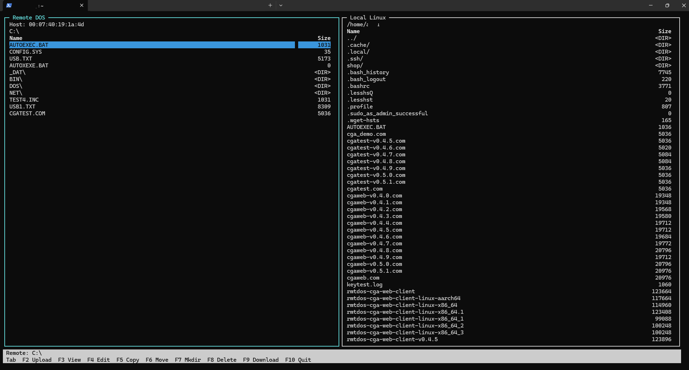
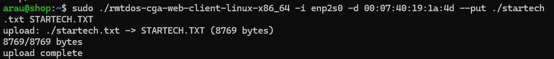
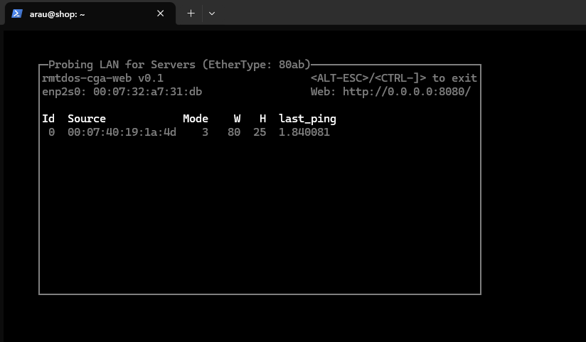

# rmtdos-utils

`rmtdos-utils` remotely controls DOS machines running the `cgaweb.com` TSR from
Linux. The Linux side is now one binary:

```sh
sudo ./out/rmtdos-utils -i enp2s0
```

The launcher discovers rmtdos hosts on the LAN, lets you select a host, then
opens either the remote shell or the dual-pane file commander. When you exit a
mode, it returns to the host selector.

The DOS side remains separate because it runs on the target machine:

- `cgaweb.com`: packet-driver TSR and rmtdos protocol server
- `cga_demo.com`: CGA graphics test program
- `vga_demo.com`: VGA text-mode test program

This repository is based on the committed history of
[`l00nix/rmtdos-cga-web`](https://github.com/l00nix/rmtdos-cga-web), a fork of
Dennis Jenkins' original
[`dennisjenkins75/rmtdos`](https://github.com/dennisjenkins75/rmtdos). The file
commander started as
[`l00nix/rmtdos-file-commander`](https://github.com/l00nix/rmtdos-file-commander)
and now lives in this tree as one mode of `rmtdos-utils`.

## Screenshots

Installing the DOS TSR:



Host selection:



Remote DOS shell:



CGA web viewer running beside the remote shell:



Space Quest through the CGA web viewer:



VGA text demo:



File commander:



File upload:



Legacy shell selector view:



## Requirements

DOS target:

- DOS, FreeDOS, MS-DOS, or equivalent
- PC/TCP packet driver, such as a Crynwr packet driver
- `cgaweb.com` copied to the DOS machine

Linux controller:

- raw Ethernet access, usually by running as root or granting capabilities
- `ncursesw` development headers to build
- `dev86` to build the DOS `.com` programs

The project has been tested with an HP 200LX running MS-DOS 5 and Linux hosts
including Ubuntu/Debian environments.

## Build

Build the unified Linux binary and the DOS `.com` programs:

```sh
make
```

Build output:

```text
out/rmtdos-utils
tools/cga-web/out/cgaweb.com
tools/cga-web/out/cga_demo.com
tools/cga-web/out/vga_demo.com
```

Optional compatibility build for the old standalone Linux clients:

```sh
make legacy-linux
```

Those legacy clients are no longer release artifacts. New releases ship one
Linux binary, `rmtdos-utils`, plus the DOS `.com` files.

## Setup

On the DOS machine, install the packet driver, then run:

```dos
CGAWEB
```

`cgaweb.com` probes for a local packet driver, registers for EtherType `80ab`,
hooks BIOS/DOS interrupts, goes resident, streams text and CGA graphics frames,
receives keystrokes, and handles file-manager protocol operations.

On Linux, run:

```sh
sudo ./out/rmtdos-utils -i enp2s0
```

Replace `enp2s0` with the Ethernet interface connected to the DOS machine.

Optional EtherType override:

```sh
sudo ./out/rmtdos-utils -i enp2s0 -e 80ab
```

## Launcher Flow

1. `rmtdos-utils` broadcasts a status probe on the selected interface.
2. DOS hosts running `cgaweb.com` appear in the selector.
3. Press `0` through `9` to select a host.
4. Press `s` for remote shell or `f` for file commander.
5. Exit either mode to return to the host selector.
6. Press `q`, `Esc`, or `Ctrl-]` in the selector to exit.

## Remote Shell

Remote shell mode shows the DOS text framebuffer and sends Linux terminal
keystrokes back to the DOS BIOS keyboard buffer.

Useful exits:

- `Ctrl-]`: exit shell mode
- `Alt-Escape`: exit shell mode when the terminal delivers it

DOS applications that use menu accelerators can receive terminal `Alt+letter`
sequences as DOS Alt-modified keystrokes. A bare tap of `Alt` usually is not
delivered by terminal emulators or SSH, so use menu accelerators such as
`Alt+F`, or application alternatives such as `F10`, when available.

## CGA Web View

Start `rmtdos-utils` with `-w` or `-W`, then choose remote shell mode:

```sh
sudo ./out/rmtdos-utils -i enp2s0 -w
sudo ./out/rmtdos-utils -i enp2s0 -W 0.0.0.0:8080
```

`-w` listens on `127.0.0.1:8080`. `-W addr[:port]` chooses the listener
address and port. The web viewer has no authentication, so only expose it on a
trusted network.

When connecting over SSH from another machine, tunnel the web port:

```sh
ssh -L 8080:127.0.0.1:8080 user@linux-host
```

Then open:

```text
http://127.0.0.1:8080/
```

The browser viewer renders CGA modes `04h` and `05h` with classic CGA palettes,
and mode `06h` as black and white. It does not currently capture dynamic CGA
palette-register changes.

## File Commander

File commander mode opens a dual-pane ncurses file manager:

- left pane: remote DOS
- right pane: local Linux

Keys:

- `Tab`: switch panes
- `Up` / `Down`: move selection
- `Enter`: enter a directory or view a file
- `F2` or `u`: upload selected local file
- `F3` or `v`: view selected local or remote file
- `F4` or `e`: edit selected local or remote file
- `F5` or `c`: copy selected file
- `F6` or `n`: rename or move selected file or directory
- `F7` or `m`: create directory
- `F8` or `x`: delete selected file or empty directory after confirmation
- `F9` or `d`: download selected or prompted DOS file
- `r`: refresh focused pane
- `F10`, `q`, `Esc`, or `Ctrl-]`: exit file commander

Viewing or editing a remote DOS file downloads it to a temporary local path.
Editing starts `$VISUAL`, `$EDITOR`, or `nano`, then asks whether to upload the
modified file back to DOS if the content changed.

## File Transfer

Use file commander mode for interactive local/remote file work.

Protocol support includes:

- upload and download
- remote directory listing
- remote mkdir
- remote delete
- remote rename/move
- remote copy

Remote file operations require a matching `cgaweb.com` TSR from this repository.

## DOS Demos

`cga_demo.com` cycles through BIOS CGA graphics modes `04h`, `05h`, and `06h`.
Run it on the DOS machine while `cgaweb.com` is resident and the Linux shell
mode is running with `-w` or `-W`.

Demo keys:

- `M`: switch CGA mode
- `Space`: redraw current pattern
- `X` or `Esc`: exit to text mode

`vga_demo.com` tests VGA text modes and patterns:

- `Alt-V`: cycle video mode
- `Alt-X`: exit

## Network Notes

By default, rmtdos uses EtherType `80ab`. To inspect raw traffic:

```sh
tcpdump 'ether proto 0x80ab'
```

Wireshark filter:

```text
eth.type == 0x80ab
```

Because `rmtdos-utils` uses raw Ethernet frames, run it with `sudo` or grant
Linux capabilities to the binary:

```sh
sudo setcap cap_net_raw,cap_net_admin=eip ./out/rmtdos-utils
```

## Releases

Release assets use versioned filenames:

```text
rmtdos-utils-vX.Y.Z-linux-x86_64
cgaweb-vX.Y.Z.com
cga_demo-vX.Y.Z.com
vga_demo-vX.Y.Z.com
SHA256SUMS
```

The shop Linux drop location is documented in
[docs/shop-deploy.md](docs/shop-deploy.md).

## Layout

```text
src/                  unified Linux launcher
tools/cga-web/        DOS TSR, demos, remote shell/web implementation
tools/file-commander/ file commander implementation
docs/                 project notes
scripts/              release/deploy helpers
```

See [NOTICE.md](NOTICE.md) for attribution notes.
